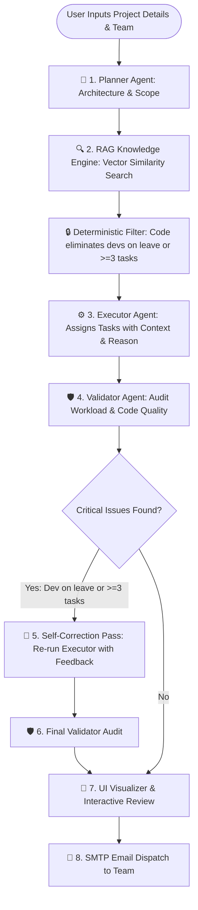

# RAG & Multi-Agent Architecture: Comprehensive Study & Interview Guide

> **Project Name:** AI Project Planner & Smart Workload Dispatcher  
> **Tech Stack:** Node.js, Express, React (Vite), Google Gemini (`gemini-3.6-flash`), Google Embeddings (`text-embedding-004`)  
> **Target Role:** Full-Stack MERN + GenAI Developer (6–10 LPA)  

---

## 1. Executive Summary & Problem Statement

### The Problem in Traditional Project Management Tools:
Project managers struggle with capacity planning. Assigning tasks manually leads to:
1. **Developer Burnout**: Overloading developers who already have too many active tasks.
2. **Skill Mismatches**: Assigning database tasks to frontend developers or vice versa.
3. **Availability Blindspots**: Mistakenly assigning critical tasks to developers on leave.

### The Naive AI Trap:
Many developers naively feed raw text prompts to an LLM like *"Assign tasks to available devs without overloading them."*  
**Why this fails**:
- LLMs hallucinate on real-time state (leave status and active task counts).
- LLMs don't consistently obey numerical boundaries (e.g., the $\ge 3$ tasks limit).
- Context windows become polluted and expensive with full policy documents.

### Our Solution: Hybrid Context Architecture
We separate **Deterministic State (Code & Database)** from **Probabilistic Reasoning (RAG & LLM)**:
- **Deterministic Rules Engine**: Strictly filters out developers who are on leave or have $\ge 3$ active tasks in backend JavaScript.
- **RAG Engine (Vector Search)**: Dynamically retrieves only the relevant assignment policies using `text-embedding-004` and mathematical cosine similarity.
- **Multi-Agent Orchestration**: Planner $\rightarrow$ RAG Retrieval $\rightarrow$ Executor $\rightarrow$ Validator $\rightarrow$ Automated Retry Loop.
- **Explainable AI (XAI)**: Every assignment includes an explicit `assignmentReason`.

---

## 2. System Architecture & Workflow Pipeline



---

## 3. Step-by-Step Implementation Breakdown

### Step 1: Upgraded Developer Data Model & Deterministic Rules
Instead of just `name` and `role`, each developer profile contains state metadata:
```javascript
{
  name: "Najeeb",
  email: "nnaju044@gmail.com",
  role: "Backend",
  skills: ["Node.js", "Express", "MongoDB", "JWT", "REST APIs"],
  activeTasksCount: 2,
  isOnLeave: false
}
```
* **Deterministic Rule**: Enforced in `server/services/promptService.js`:
  ```javascript
  const eligibleMembers = teamMembers.filter(m => !m.isOnLeave && (m.activeTasksCount ?? 0) < 3);
  ```
  *Anyone on leave or with 3+ active tasks is completely excluded before the prompt is created.*

---

### Step 2: External Assignment Knowledge Base
Domain-specific assignment policies are decoupled from backend code:
- **Backend Rules**: API, authentication, server logic $\rightarrow$ Backend devs.
- **Frontend Rules**: UI/UX, responsive styling $\rightarrow$ Frontend devs.
- **Database/DevOps Rules**: Schema, migrations, Redis caching, Docker $\rightarrow$ Database devs.
- **QA Rules**: Test suites, Cypress, Jest $\rightarrow$ QA devs.
- **Workload Limit**: Maximum 3 active tasks per developer.
- **Leave Rules**: Zero tasks assigned to developers on leave.
- **Priority Rules**: High-priority tasks assigned to most experienced available devs.

---

### Step 3: Vector Database & Mathematical Cosine Similarity
Implemented in `server/services/ragService.js`:
1. **Vector Embedding**: Each policy chunk is converted into a 768-dimensional float vector using Google's `text-embedding-004`:
   ```javascript
   const response = await ai.models.embedContent({
     model: 'text-embedding-004',
     contents: `${chunk.topic}: ${chunk.content}`,
   });
   const vector = response.embedding.values;
   ```
2. **Cosine Similarity**: Measures the cosine of the angle between query vector $A$ and policy vector $B$:
   $$\text{Similarity}(A, B) = \frac{A \cdot B}{\|A\| \cdot \|B\|} = \frac{\sum_{i=1}^n A_i B_i}{\sqrt{\sum_{i=1}^n A_i^2} \cdot \sqrt{\sum_{i=1}^n B_i^2}}$$
3. **In-Memory Vector Store**: Stores embeddings on server initialization (`initializeVectorStore`), ready for sub-millisecond retrieval.

---

### Step 4: Semantic Retrieval Function
Implemented in `retrieveRelevantPolicies(ai, query, topK = 4)`:
- Takes the project requirements and tech stack.
- Embeds the query and computes similarity scores against all stored policies.
- Ranks policies descending by score and extracts the top $K$ most relevant policies.
- Logs match percentages in the console (e.g. `[91.4% match] Backend & API Assignment`).

---

### Step 5: Context-Augmented Prompt Injection
The Executor Agent receives a dynamic 3-part context:
1. **The Project Scope**: Provided by the Planner Agent.
2. **The Retrieved Policies (RAG)**: Provided by the Vector Search.
3. **The Pre-Filtered Developers**: Only developers with available capacity and matching skill tags.

---

### Step 6: Explainable AI (XAI) Output
The Executor does not merely output an email address; it produces an explicit `assignmentReason`:
```json
{
  "title": "Build Redis Token Blacklist",
  "assignedName": "Najeeb",
  "assignedToEmail": "nnaju044@gmail.com",
  "assignmentRole": "Backend",
  "assignmentReason": "Assigned to Najeeb due to his Node.js & MongoDB expertise and light current workload (2 tasks)."
}
```

---

### Step 7: Independent Validator Audit
Implemented in `detectCriticalIssues(validatorData, phases, teamMembers)`:
Even if the LLM hallucinated, the backend runs an independent check:
- Did any task get assigned to a developer with `isOnLeave === true`?
- Did any task get assigned to a developer with `activeTasksCount >= 3`?
If violated, it flags `shouldRetry: true` and logs the exact violation reason.

---

### Step 8: Self-Healing Correction Loop (Retry Pass)
If `issueCheck.shouldRetry === true`:
1. Re-invokes the Executor with the Validator's feedback:  
   `⚠️ VALIDATOR FEEDBACK — YOU MUST FIX THESE ISSUES: Task was assigned to Bennet who already has 3 active tasks.`
2. The Executor reallocates the task to an available developer.
3. The Validator runs a final confirmation pass.

---

### Step 9: Frontend Workflow Visualizer
In `src/components/WorkflowVisualizer.jsx`:
- Visual representation of each stage with duration metrics ($ms$).
- Interactive task cards displaying:
  - 📌 **Task Title**
  - 👤 **Assigned Developer**
  - 💡 **AI Match Reason**
  - ✓ **Validation Status (`✓ Passed`)**
- Team Leader interactive reassignment dropdowns & SMTP email triggers.

---

## 4. Key Interview Questions & Ideal Answers

### Q1: Why didn't you store leave status directly in the vector database?
> **Answer:** *"Vector search is probabilistic and semantic, not deterministic. If a developer applies for leave today, re-indexing embeddings is computationally slow and eventual consistency creates lag. Furthermore, vector search cannot reliably handle exact date ranges or binary boolean states (`isOnLeave: true`). Therefore, I used a hybrid architecture: MongoDB/JavaScript handles deterministic state checks, while Vector Embeddings handle semantic skill affinity."*

### Q2: How does your RAG pipeline work end-to-end?
> **Answer:** *"When a project plan is requested, our system first embeds the domain policies using Google's `text-embedding-004`. When tasks are broken down, we embed the task description and tech requirements, calculate cosine similarity against our policy vectors, and retrieve the top-K relevant policies. We augment the Executor Agent's prompt with these retrieved policies alongside pre-filtered eligible developers. The Executor assigns tasks and generates explainable reasons for each selection."*

### Q3: How do you prevent hallucinations in task delegation?
> **Answer:** *"We use a 3-layer defense:
> 1. Pre-filtering: Ineligible developers (on leave or $\ge 3$ tasks) are completely excluded from the prompt.
> 2. Structured JSON schema: We constrain Gemini to return typed fields including `assignmentReason`.
> 3. Post-execution Validator Audit: An independent validation function inspects the generated plan. If any business rule is violated, it triggers an automated retry pass with feedback."*

---

## 5. Copy-Paste AI Study & Quiz Prompt

*Copy and paste the prompt below into ChatGPT, Claude, or Gemini to test your knowledge:*

```text
Act as a Principal Software Engineer and hiring manager conducting a technical interview for a 6-10 LPA Full-Stack MERN + GenAI role in India.

Here is the architecture of the project I built:
- Project: AI Project Planner with Smart Workload Dispatcher & RAG.
- Stack: Node.js, Express, React, Google Gemini (gemini-3.6-flash), Embeddings (text-embedding-004).
- Key Features:
  1. Real-time deterministic capacity filter (max 3 active tasks, exclude developers on leave in code).
  2. RAG Knowledge Base with domain assignment policies (Frontend, Backend, DB, QA, Workload, Priority).
  3. Mathematical Cosine Similarity search over 768-dimensional vectors.
  4. Dynamic Context Augmentation in the Executor Agent.
  5. Explainable AI (XAI) output returning assignmentReason for each task.
  6. Independent Validator Agent and automated retry loop for self-healing plans.
  7. Visual pipeline UI showing duration, matched reasons, and validation badges.

Rules for the interview:
1. Ask me ONE challenging technical question at a time.
2. Cover: Vector search mathematics, why RAG was chosen over fine-tuning, deterministic vs. probabilistic boundaries, token optimization, and edge cases.
3. After I answer, critique my response on a scale of 1-10, explain how a senior engineer would answer, and ask the next question.
4. Start by asking me Question 1.
```


server/
├── config/
│   ├── env.js                # Validates process.env on startup (fails fast if keys are missing)
│   └── gemini.js             # Initialized AI client singleton
├── controllers/
│   ├── planController.js     # Handles /api/project/plan requests
│   ├── emailController.js    # Handles /api/project/send-emails
│   └── assistantController.js# Handles /api/project/assistant
├── middlewares/
│   ├── errorHandler.js       # Centralized error handler returning uniform JSON
│   ├── validate.js           # Zod schema validation middleware
│   └── rateLimiter.js        # IP & User based rate limiters
├── models/
│   ├── Project.js            # Mongoose schema: project metadata & deadlines
│   ├── Plan.js               # Plan phases, tasks, validation audit logs
│   └── TeamMember.js         # Developers, skills, activeTaskCount, leave status
├── routes/
│   ├── index.js              # Aggregator for all API routes (/api/v1/...)
│   ├── planRoutes.js
│   ├── emailRoutes.js
│   └── assistantRoutes.js
├── services/
│   ├── ai/
│   │   ├── plannerAgent.js   # Decomposed from promptService.js
│   │   ├── executorAgent.js
│   │   └── validatorAgent.js
│   ├── ragService.js         # Embeddings, vector memory, cosine similarity
│   └── emailService.js       # Nodemailer / SendGrid dispatch logic
├── validations/
│   └── projectValidation.js  # Zod schemas for incoming payloads
└── index.js                  # App bootstrap only (listen, DB connect, middleware mount)


src/
├── api/
│   └── client.js             # Axios / fetch wrapper with base URL and error interceptors
├── components/
│   ├── Header.jsx
│   ├── ProjectForm.jsx       # Isolated form input
│   ├── PlanViewer/           # Phases, timeline, task assignment cards
│   ├── AIAssistantModal.jsx  # Floating chat assistant
│   └── WorkflowVisualizer.jsx
├── hooks/
│   ├── useProjectPlan.js     # Encapsulates loading, plan generation, and error state
│   └── useAssistant.js       # Encapsulates conversation history & messaging
└── App.jsx                   # Clean high-level layout container (< 100 lines)


//=======================

To crack an 8 to 10 LPA (Mid-to-Senior SDE-1 / SDE-2) role in the current market, interviewers do not just look at whether an app "works." They look at engineering maturity, architectural decisions, system resilience, and code scalability.

Here is the exact architectural evaluation, why traditional MVC is the wrong fit, and a roadmap to transform this project into an interviewer magnet.

1. MVC vs. Layered Architecture: Which Should You Use and Why?
❌ Why Pure MVC is NOT Appropriate Here
MVC (Model-View-Controller) was designed for server-rendered monolithic applications (like Ruby on Rails, Django, or Express with EJS/Pug templates) where the server renders the HTML "View".
In your stack, React (Vite) is already the View.
In a typical Express API, developers who try to follow "MVC" end up dumping everything (AI prompt chaining, RAG math, email formatting, database queries, and response formatting) into the Controller. This creates "Fat Controllers" that are impossible to unit test and maintain.
What You Should Use: Layered (3-Tier) Architecture / Clean Service-Oriented Pattern
For modern Node.js + GenAI applications, the industry standard that interviewers love is Route $\rightarrow$ Controller $\rightarrow$ Service $\rightarrow$ Model / Repository:

[ HTTP Request ]
       │
       ▼
┌─────────────────┐
│     Routes      │  --> Endpoint definitions, route-specific middlewares (auth, validation, rate limits)
└────────┬────────┘
         ▼
┌─────────────────┐
│   Controllers   │  --> HTTP layer ONLY: extracts req.body/params, calls services, sends HTTP status codes
└────────┬────────┘
         ▼
┌─────────────────┐
│    Services     │  --> Pure Business Logic: AI prompt chaining, RAG vector retrieval, Email dispatch
└────────┬────────┘
         ▼
┌─────────────────┐
│  Models / DAOs  │  --> Database schemas (MongoDB / PostgreSQL) & data persistence
└─────────────────┘
Why Interviewers Respect This Architecture:
Single Responsibility Principle (SRP): Your HTTP logic (Express) is completely detached from your AI workflow. If tomorrow you want to switch from Express to Fastify, or run the AI workflow as a background queue worker (BullMQ), your AI services don't need a single change.
True Testability: You can write unit tests for your RAG cosine similarity or your planner agent using mock data without having to start an Express HTTP server or mock req and res.
Decoupling AI Providers: You can create an AI provider adapter. Switching from Google Gemini to Anthropic Claude or OpenAI requires editing only the AI adapter service, leaving the controller and business logic intact.
2. The 5 Critical Gaps Holding Your Project Back from 8–10 LPA
Right now, your core logic (RAG, multi-agent fallback, deterministic filtering) is already much better than typical beginner projects. However, the surrounding engineering is currently at a junior level:

Area	Current State (Junior)	Senior Standard (8–10 LPA)
Backend Entry	Monolithic server/index.js (routes, AI initialization, rate limiting, and handlers bundled together)	Modular folder structure with clean routing, dedicated controllers, and isolated service modules
Data Persistence	Zero Database: Plans and assignments vanish the moment the browser reloads	MongoDB / PostgreSQL: Users, projects, generated plans, and task statuses are saved and queryable
Validation	Basic inline if (!projectName) checks	Robust schema validation using Zod or Joi middleware with automatic typed error responses
Frontend State	Monolithic App.jsx (>600 lines) handling state, UI, API calls, and modals	Component breakdown with custom hooks (useProjectPlanner, useWorkflow), and dedicated API client (services/api.js)
Error Handling	Generic catch (error) { res.status(500) }	Centralized global error handler middleware with custom AppError classes (400, 401, 404, 429, 502)
Auth & Security	Anyone can hit the endpoints and drain your Gemini API credits	JWT-based authentication (Role: Admin / Team Lead / Developer) and user-scoped quotas
3. Recommended Folder Structure
Backend (/server):
text
server/
├── config/
│   ├── env.js                # Validates process.env on startup (fails fast if keys are missing)
│   └── gemini.js             # Initialized AI client singleton
├── controllers/
│   ├── planController.js     # Handles /api/project/plan requests
│   ├── emailController.js    # Handles /api/project/send-emails
│   └── assistantController.js# Handles /api/project/assistant
├── middlewares/
│   ├── errorHandler.js       # Centralized error handler returning uniform JSON
│   ├── validate.js           # Zod schema validation middleware
│   └── rateLimiter.js        # IP & User based rate limiters
├── models/
│   ├── Project.js            # Mongoose schema: project metadata & deadlines
│   ├── Plan.js               # Plan phases, tasks, validation audit logs
│   └── TeamMember.js         # Developers, skills, activeTaskCount, leave status
├── routes/
│   ├── index.js              # Aggregator for all API routes (/api/v1/...)
│   ├── planRoutes.js
│   ├── emailRoutes.js
│   └── assistantRoutes.js
├── services/
│   ├── ai/
│   │   ├── plannerAgent.js   # Decomposed from promptService.js
│   │   ├── executorAgent.js
│   │   └── validatorAgent.js
│   ├── ragService.js         # Embeddings, vector memory, cosine similarity
│   └── emailService.js       # Nodemailer / SendGrid dispatch logic
├── validations/
│   └── projectValidation.js  # Zod schemas for incoming payloads
└── index.js                  # App bootstrap only (listen, DB connect, middleware mount)
Frontend (/src):
text
src/
├── api/
│   └── client.js             # Axios / fetch wrapper with base URL and error interceptors
├── components/
│   ├── Header.jsx
│   ├── ProjectForm.jsx       # Isolated form input
│   ├── PlanViewer/           # Phases, timeline, task assignment cards
│   ├── AIAssistantModal.jsx  # Floating chat assistant
│   └── WorkflowVisualizer.jsx
├── hooks/
│   ├── useProjectPlan.js     # Encapsulates loading, plan generation, and error state
│   └── useAssistant.js       # Encapsulates conversation history & messaging
└── App.jsx                   # Clean high-level layout container (< 100 lines)
4. High-Impact Upgrades to "WOW" Your Interviewer
If you do these four things, you will instantly stand out from 95% of candidates applying for 8–10 LPA roles:

1. Add Streaming / Server-Sent Events (SSE)
Problem: When a user clicks "Generate Plan", the multi-agent pipeline takes 8–15 seconds. A simple spinner looks frozen.
Senior Upgrade: Stream the agent thought processes via SSE (res.write("data: ...")) as each step completes:
Agent 1: "Architecting project phases and milestones..."
RAG Engine: "Retrieved 3 matching policies: [Backend, Database, WorkloadLimit]"
Agent 2: "Allocating tasks to eligible developers..."
Agent 3: "Validating workload thresholds and constraints..."
Interview Impact: Demonstrates understanding of asynchronous protocols, UX for LLMs, and HTTP streaming.
2. Introduce Database Persistence & Versioning (MongoDB)
Save plans to MongoDB with status flags (DRAFT, APPROVED, DISPATCHED).
Add a "Plan Revision History" feature: if a user edits a plan or re-runs the validator, save it as a new version.
Interview Impact: Proves you are a true Full-Stack engineer, not just someone writing frontend wrappers around AI API endpoints.
3. Implement Zod Schema Validation & Centralized Custom Errors
Never let raw user inputs hit your services.
Define strict Zod schemas for projectName, teamMembers, deadline (number, positive integer, max 365).
Create an AppError class extending Error with statusCode, isOperational.
Interview Impact: Shows defensive programming and production readiness.
4. Add Unit Tests with Jest or Vitest
Write 3 to 5 tests for:
Deterministic rule engine: Guaranteeing a developer with isOnLeave: true or activeTasksCount >= 3 is NEVER passed to the prompt.
Vector math: Testing cosine similarity function with known orthogonal/identical vectors.
Interview Impact: Almost no fresher/junior writes unit tests. Having automated tests in your GitHub repo immediately signals mid-to-senior capability.
5. How to Pitch This in an Interview (The Script)
When the interviewer asks: "Tell me about the most technically challenging project you built", answer like this:

"I built an AI-Powered Project Planning and Workload Dispatcher. The primary problem with off-the-shelf GenAI tools is that LLMs hallucinate real-time constraints—they regularly assign critical tasks to developers who are on leave or exceed capacity limits.

Instead of relying on naive prompting, I architected a Hybrid Context System:

A deterministic rules engine in code that strictly filters out unavailable team members prior to prompt construction.
A RAG pipeline using Google Embeddings and mathematical cosine similarity to inject domain-specific task assignment policies without polluting the context window.
A multi-agent loop (Planner $\rightarrow$ Executor $\rightarrow$ Validator) with automated self-correction if constraints are breached.
Architecturally, I decoupled the backend into a Layered Controller-Service pattern rather than monolithic MVC, ensuring business and AI orchestration logic remain completely independent of the Express HTTP transport layer, with full database persistence and strict schema validation."

Recommended First Step:
Would you like to start by refactoring the backend into the Layered Architecture (Controllers, Routes, Services, Validations) while keeping all existing functionality working, or would you prefer to plan the MongoDB database integration first?

12:11 PM
